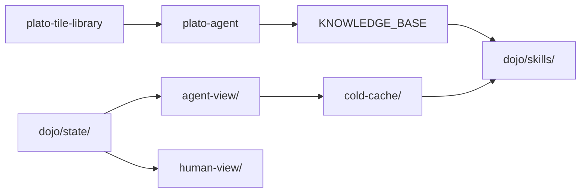

# PLATO Dojo — Ecosystem Synergy Map

This dojo is the proof-of-concept for the repo-native agent model.
Here's how it connects to everything else:

## Direct Connections

| Component | Role | How It Connects |
|-----------|------|----------------|
| **hermes-construct** | Agent runtime | Rooms protocol, gravity model, module system. The dojo room config is compatible. |
| **plato-tile-library** | Knowledge base | 61K tiles from 162 rooms. Agents ingest these as training data before playing. |
| **plato-mythos** | Model architecture | Recurrent-depth transformer with PLATO-native attention (tiles=KV, rooms=experts). |
| **keel** | Coordination backbone | Provision the dojo across fleet instances. One-command deploy. |
| **plato-agent/** | Mining & cold cache | KNOWLEDGE_BASE cross-pollinates to dojo skills. Cold cache pattern shared. |
| **pincher** | Reflex engine | The agent's "react to trigger" pattern IS a reflex: trigger → match → execute. |

## The Perspective Decoupling

```
plato-tile-library ──→ Agent ingests tiles as training data
                          │
                          ▼
                    plato-dojo/state/game.json  ←── Single truth
                     ╱                ╲
                    ▼                  ▼
          agent-view/             human-view/
          (JSON TUI)              (vibe render)
               │                      │
               ▼                      ▼
      hermes-construct          Three.js / Unity /
      (room-native agent)       Terminal / Custom UI
```

## Shared Patterns

1. **State as JSON in Git**: Every project writes state as files. Git is the audit log.
2. **Triggers over Polling**: Agents wake on trigger files, not polling loops.
3. **Cold Cache over Training Data**: Agent learns from cached reasoning, not just model weights.
4. **Perspectives over Full Access**: Agent doesn't need full state — it needs a compressed view.
5. **Rooms over Monoliths**: Isolated contexts with gravity, budget, deadband — from Hermes-construct.
6. **Tiles over Databases**: Knowledge is discrete tiles (from PLATO), not rows in a SQL table.

## Pipeline


